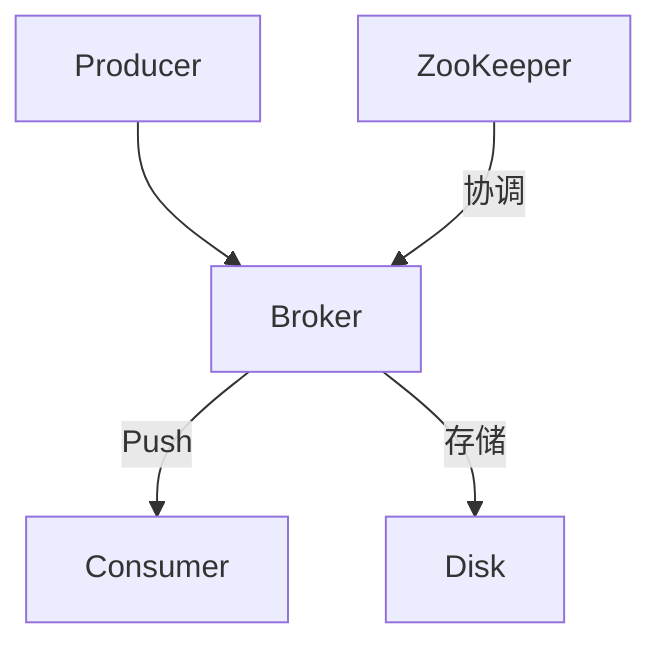

Kfka是一个消息队列,用于缓存消息,模型为生产者消费者。

# kafka消息的两种模型 

1.点对点, 一个消费者

2.发布订阅, 多个消费者


-------------------------------


# Apache Kafka 学习笔记

## 目录
1. [概述](#概述)
2. [核心概念](#核心概念)
3. [架构设计](#架构设计)
4. [安装与配置](#安装与配置)
5. [基本操作](#基本操作)
6. [高级特性](#高级特性)
7. [应用场景](#应用场景)
8. [优缺点分析](#优缺点分析)
9. [学习资源](#学习资源)

---

## 概述
Apache Kafka 是一个**分布式流处理平台**，主要用于：
- 构建实时数据管道
- 实现流式数据处理
- 高吞吐量消息系统

特性：
✅ 高吞吐量（百万级TPS）  
✅ 低延迟（毫秒级）  
✅ 持久化存储  
✅ 水平扩展  
✅ 高容错性

---

## 核心概念

### 1. 消息（Message）
- 基本数据单元，包含：
  - Key（可选）
  - Value
  - 时间戳
  - 头信息（Headers）

### 2. Topic
- 消息的逻辑分类（类似数据库表）
- 支持多订阅者模式

### 3. Partition
- Topic的物理分片
- 保证消息顺序性
- 分区策略：
  - Round-robin
  - Key哈希
  - 自定义

### 4. Broker
- Kafka集群节点
- 负责消息存储和转发

### 5. Producer
- 消息生产者
- 重要配置：
  ```java
  props.put("bootstrap.servers", "localhost:9092");
  props.put("acks", "all"); // 消息确认机制
  props.put("retries", 3);  // 重试次数


### 6. Consumer
- 消息消费者
- 消费组（Consumer Group）机制：
  - 组内消费者共享Topic
  - 每个分区只能被组内一个消费者消费

### 7. Offset
- 消费者在分区中的消费位置
- 存储位置：
  - __consumer_offsets Topic
  - 本地存储（旧版本）

### 8. Replica
- 副本机制保障高可用
- 类型：
  - Leader Replica（处理读写）
  - Follower Replica（同步数据）

---

## 架构设计


关键组件：
1. **ZooKeeper**：
   - 集群元数据存储
   - Broker节点管理
   - 控制器选举

2. **Broker集群**：
   - 无主从架构
   - 自动负载均衡

3. **Producer/Consumer API**：
   - 支持多种语言客户端

---

## 安装与配置

### 快速启动（单节点）
```bash
# 下载（示例版本）
wget https://archive.apache.org/dist/kafka/3.2.0/kafka_2.13-3.2.0.tgz

# 启动ZooKeeper
bin/zookeeper-server-start.sh config/zookeeper.properties

# 启动Kafka
bin/kafka-server-start.sh config/server.properties
```

### 重要配置参数
```properties
# server.properties
broker.id=0
listeners=PLAINTEXT://:9092
log.dirs=/tmp/kafka-logs
num.partitions=3
default.replication.factor=1
```

---

## 基本操作

### Topic管理
```bash
# 创建Topic
kafka-topics.sh --create --topic test --partitions 3 --replication-factor 1
# partitions 分区数 | replication-factor 副本数 | topic 主题名字
# 查看Topic列表
kafka-topics.sh --list

# 查看Topic详情
kafka-topics.sh --describe --topic test
```

### 生产消息
```bash
kafka-console-producer.sh --topic test --bootstrap-server localhost:9092
```

### 消费消息
```bash
kafka-console-consumer.sh --topic test --from-beginning --bootstrap-server localhost:9092
```

---

## 高级特性

### 1. 消息持久化
- 数据保留策略：
  - 时间保留（默认7天）
  - 大小保留
- 日志分段存储

### 2. 精确一次语义（Exactly-Once）
- 生产者配置：
  ```java
  props.put("enable.idempotence", true);
  props.put("transactional.id", "my-transactional-id");
  ```

### 3. Streams API
```java
KStream<String, String> stream = builder.stream("input-topic");
stream.filter((k, v) -> v.contains("important"))
      .to("output-topic");
```

---

## 应用场景
1. **实时日志收集**  
   Flume -> Kafka -> Elasticsearch

2. **事件溯源**  
   使用Topic保存状态变更历史

3. **流处理**  
   Kafka Streams实时计算

4. **消息总线**  
   微服务间异步通信


# JAVA_API

```xml
<dependencies>
    <!-- Kafka Clients -->
    <dependency>
        <groupId>org.apache.kafka</groupId>
        <artifactId>kafka-clients</artifactId>
        <version>2.8.0</version>
    </dependency>
    <!-- 如果使用 Spring Boot，可添加以下依赖 -->
    <dependency>
        <groupId>org.springframework.kafka</groupId>
        <artifactId>spring-kafka</artifactId>
        <version>2.7.0</version>
    </dependency>
</dependencies>
```

```java
public class KafkaProducerExample {
    public static void main(String[] args) {
        // 配置属性
        Properties props = new Properties();
        props.put(ProducerConfig.BOOTSTRAP_SERVERS_CONFIG, "localhost:9092");
        props.put(ProducerConfig.KEY_SERIALIZER_CLASS_CONFIG, StringSerializer.class.getName());
        props.put(ProducerConfig.VALUE_SERIALIZER_CLASS_CONFIG, StringSerializer.class.getName());
 
        // 创建生产者
        Producer<String, String> producer = new KafkaProducer<>(props);
 
        // 发送消息
        for (int i = 0; i < 10; i++) {
            ProducerRecord<String, String> record = new ProducerRecord<>("your_topic", "key" + i, "value" + i);
            producer.send(record);
        }
 
        // 关闭生产者
        producer.close();
    }
}


// 消费者 -------------------------------------------------------------

public class KafkaConsumerExample {
    public static void main(String[] args) {
        // 配置属性
        Properties props = new Properties();
        props.put(ConsumerConfig.BOOTSTRAP_SERVERS_CONFIG, "localhost:9092");
        props.put(ConsumerConfig.GROUP_ID_CONFIG, "your_group_id");
        props.put(ConsumerConfig.KEY_DESERIALIZER_CLASS_CONFIG, StringDeserializer.class.getName());
        props.put(ConsumerConfig.VALUE_DESERIALIZER_CLASS_CONFIG, StringDeserializer.class.getName());
 
        // 创建消费者
        Consumer<String, String> consumer = new KafkaConsumer<>(props);
 
        // 订阅主题
        consumer.subscribe(Collections.singletonList("your_topic"));
 
        // 持续消费消息
        try {
            while (true) {
                ConsumerRecords<String, String> records = consumer.poll(Duration.ofMillis(100));
                records.forEach(record -> {
                    System.out.printf("Consumed message: key = %s, value = %s, offset = %d%n",
                            record.key(), record.value(), record.offset());
                });
            }
        } finally {
            // 关闭消费者
            consumer.close();
        }
    }
```

多个broker担任同一个主题, 多个分区

把自己的数据放到别的节点上实现备份